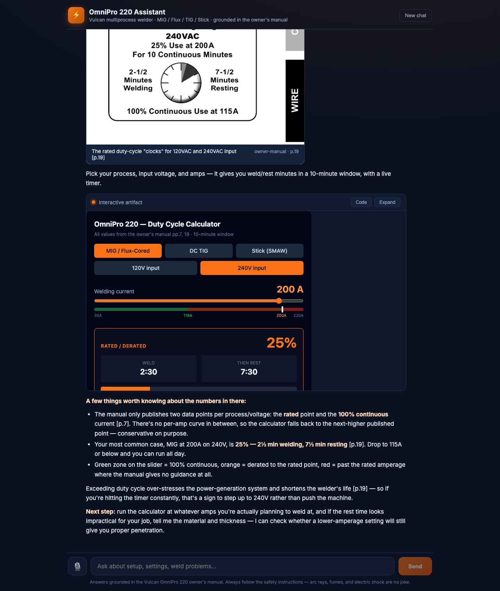
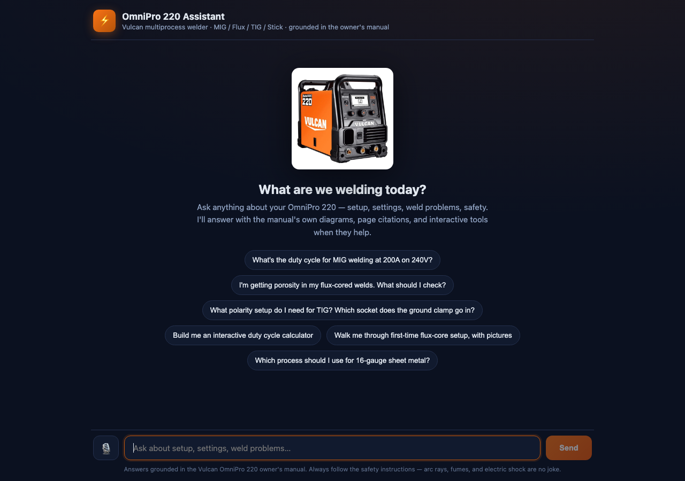
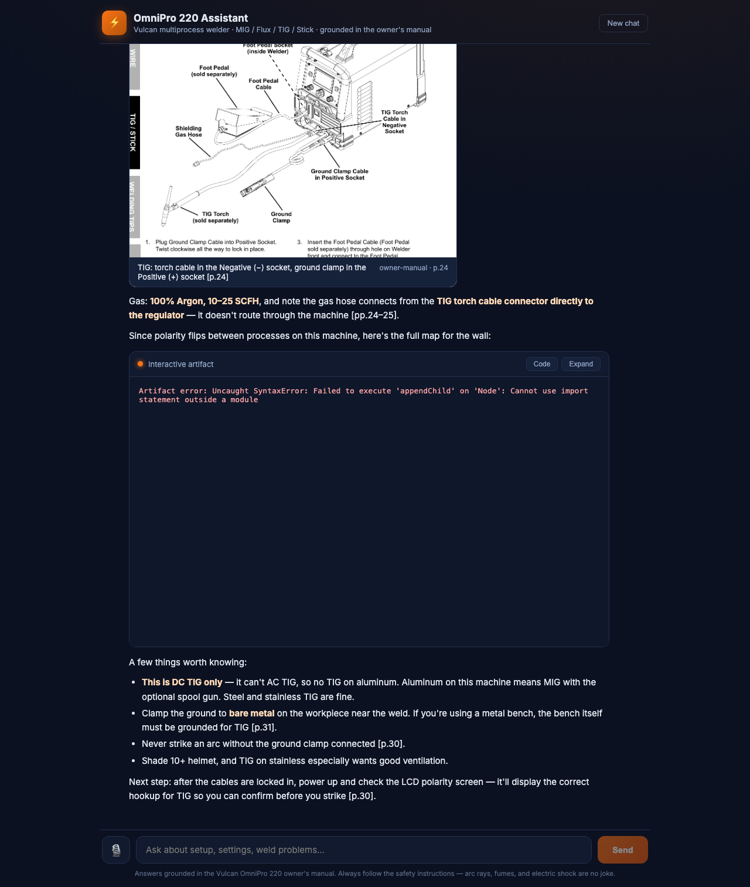

# OmniPro 220 Assistant — a multimodal reasoning agent for a real machine

A locally-runnable expert assistant for the **Vulcan OmniPro 220** multiprocess welder (MIG / Flux-Cored / DC TIG / Stick), built on the **Claude Agent SDK**. Ask it anything about the machine and it answers like a knowledgeable welding buddy — grounded in the 48-page owner's manual with page citations, and **not just in text**: it surfaces the manual's actual diagrams, draws its own, and generates live interactive tools (calculators, configurators, flowcharts) right in the chat.



> The screenshot above is a real response: asked about duty cycle, the agent surfaced the manual's own duty-cycle chart (p.19), then generated a working React calculator — process/voltage toggles, an amperage slider with color-coded 100%-continuous / rated / beyond-rated zones — with every number pulled from structured spec data, not from memory.

## Run it (under 2 minutes)

```bash
git clone https://github.com/Karan-05/prox-challenge.git
cd prox-challenge
cp .env.example .env        # paste your Anthropic API key
npm install
npm run dev                 # → http://localhost:5173
```

Requirements: Node 18+ and an `ANTHROPIC_API_KEY`. That's it — no database, no embedding step, no Python. (`npm start` builds and serves everything on one port, `:3001`, if you prefer a single process.)

Try the suggestion chips, or these:

- *"What's the duty cycle for MIG welding at 200A on 240V?"* → exact answer (25%, 2½ min weld / 7½ min rest) with the manual's chart and a live calculator
- *"I'm getting porosity in my flux-cored welds"* → cross-referenced diagnosis (polarity → DCEN, cleanliness, CTWD…) with the manual's defect photos
- *"What polarity setup do I need for TIG?"* → the real hookup diagram from p.24, torch→negative, ground→positive
- *"Which process should I use for 16-gauge sheet?"* → reasoning over the image-only selection chart
- *"Can I TIG weld aluminum with this?"* → correctly says no (DC TIG only) and routes you to the spool-gun option

There's also a scripted accuracy check: `npm run eval` runs the hard questions end-to-end and asserts the key facts, figures, and artifacts appear. Current result: **6/6**.

## How it works

```
Browser ── React chat (Vite) ── streaming SSE
  │   ├─ Markdown renderer with inline page citations
  │   ├─ FigureCard  → real manual images, zoomable, captioned with page refs
  │   └─ ArtifactFrame → sandboxed iframe running agent-written React/SVG/HTML
  ▼
Express ── /api/chat ── Claude Agent SDK query()
  │   custom in-process MCP tools:
  │   ├─ search_manual(query)      lexical search over the curated knowledge base
  │   ├─ get_specs(topic)          exact structured data (duty cycles, polarity map…)
  │   ├─ show_figure(id, caption)  streams a manual figure into the chat mid-answer
  │   └─ read_manual_page(source, page)  vision escape hatch: the original page image
  ▼
data/  ── knowledge/*.md (16 hand-verified, page-cited files)
       ── specs.json (machine-readable spec tables) · figures.json (29-figure catalog)
web/public/manual/ ── all 51 PDF pages + 29 curated figure crops as PNGs
```

**One turn, concretely:** your question hits `query()` with a system prompt that carries the agent's persona, the accuracy rules, and the full figure catalog. The agent searches the knowledge base, pulls exact numbers from `specs.json`, and streams its answer. When it calls `show_figure`, the tool handler pushes a figure event straight onto the SSE stream — the image appears in the chat at the exact point of the answer where the agent referenced it. Artifact code blocks (```` ```artifact:react ````) are detected client-side and rendered in a sandboxed iframe. Multi-turn context uses the SDK's session resume.

## Knowledge extraction — the part that makes it accurate

The manual is 48 pages of mixed text, tables, labeled diagrams, decision matrices, and photos — and some critical content (the process selection chart, the weld diagnosis examples, the wiring schematic) exists **only as images**. Rather than stuffing PDFs into context or building a lossy RAG index, I converted the corpus once, by hand, into three complementary representations (all committed, nothing to re-run):

1. **`data/knowledge/*.md`** — 16 curated files organized by *task* (polarity & cables, duty cycle, MIG/flux setup, weld diagnosis, troubleshooting, …), written from a complete read of all three PDFs. Every fact carries its page number, so the agent cites `[p.19]` and you can check it. Image-only content (selection chart, defect photo captions, schematic topology) was transcribed into text so it's searchable too.
2. **`data/specs.json`** — the numbers as data: all six duty-cycle matrices, current ranges, the per-process polarity map, gas flows, tensioner settings. This powers `get_specs`, so numbers in answers and generated calculators are *copied*, never recalled from model weights.
3. **Image assets** — every page rendered to PNG plus 29 curated figure crops (`scripts/extract_assets.py`, poppler + Pillow), cataloged in `figures.json` with ids, titles, pages, and keywords. These are what `show_figure` surfaces and what `read_manual_page` lets the agent *look at* when a question outruns the curated text.

Honesty is designed in: the manual doesn't publish a WFS/voltage-per-thickness matrix (the machine's synergic Auto Weld mode computes it). The knowledge base says so explicitly, and the agent is instructed to give the manual-backed procedure first and label any rule-of-thumb as general guidance — instead of inventing numbers that look authoritative.

## Multimodal responses — three tiers

1. **Real manual figures first.** For anything the manual already illustrates (polarity hookups, wire-feed mechanism, defect examples…), ground truth beats a redrawing. The agent picks from the 29-figure catalog embedded in its system prompt.
2. **Generated interactive artifacts** for cognitively heavy answers — Claude-Artifacts-style. The agent emits `artifact:react|svg|html` fenced blocks; the client renders them in a sandboxed iframe (`sandbox="allow-scripts"`) with React 18 UMD + Babel standalone + Tailwind. Artifacts are interactive (state, sliders, toggles), and the system prompt requires every number in them to come from tool results.
3. **Markdown/inline SVG** for everything simple — no forced visuals on yes/no questions.

Plus **voice input** (Web Speech API, Chrome/Edge) — handy when your gloves are off but your hands are full.

## Design decisions worth calling out

- **Curated KB over RAG or PDF-in-context.** A 48-page corpus doesn't need embeddings; it needs *fidelity*. Hand-curation with page cites made accuracy auditable, kept per-turn token cost low, and turned every figure into an addressable asset the UI can render. The `read_manual_page` vision tool remains as the escape hatch to primary sources.
- **Tools stream UI events.** `show_figure` doesn't return an image to the model (wasted tokens) — it emits an SSE event to the browser and returns a short confirmation to the model. The model narrates around a figure it placed; the user sees it exactly where it belongs in the answer.
- **Server isolation.** The Agent SDK runs with `settingSources: []`, no built-in tools (`tools: []`), and an allowlist of only the four manual tools — it's a product server, not a dev sandbox.
- **Deterministic search.** Lexical scoring over heading-split sections. For 16 documents, deterministic-and-debuggable beats semantic-and-mysterious.
- **Model:** `claude-opus-5` by default (override with `CLAUDE_MODEL` in `.env`). A typical multimodal answer costs $0.05–0.15.
- One gotcha for fellow artifact-builders: unpkg's `@babel/standalone` now serves Babel 8, whose React transform emits ESM (`import {jsx} …`) that can't run in a classic inline script — pin `@babel/standalone@7`.

## What the agent is instructed to do (behavior contract)

Search before answering; never guess numbers; cite pages; prefer real figures, then artifacts, then prose; ask exactly one clarifying question when the answer genuinely depends on unstated variables (process/voltage/wire/thickness) but lead with the most likely answer when possible; surface proportionate safety warnings (shade-10+, ventilation, duty cycle, no extension cords) without preaching; and correct misconceptions (like AC TIG) gently. See `server/prompt.ts` — it's short and readable.

## Project structure

```
server/          Express + Agent SDK (index.ts, agent.ts, prompt.ts, knowledge.ts)
web/             Vite + React chat UI (App, Message, ArtifactFrame, styles)
data/            knowledge/*.md · specs.json · figures.json
web/public/manual/  page renders + figure crops (committed)
scripts/         extract_assets.py (one-time) · eval.ts (npm run eval) · ui_probe.mjs (headless UI test)
docs/            CHALLENGE.md (original brief) · design doc · screenshots
files/           original PDFs (untouched)
```

## Screenshots

| Landing | Manual figure surfaced (TIG polarity) |
|---|---|
|  |  |

## Future work

Hosting (the server is a single Node process — Fly/Render-ready), spoken responses (TTS out), streaming artifact preview while the block is still generating, and generalizing the extraction pipeline to any product manual — which is, after all, the point.
